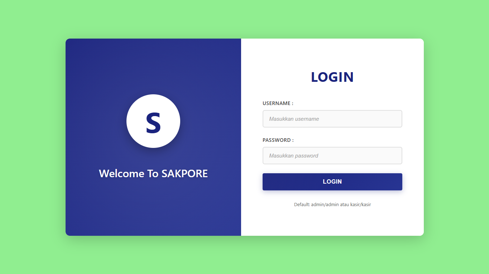
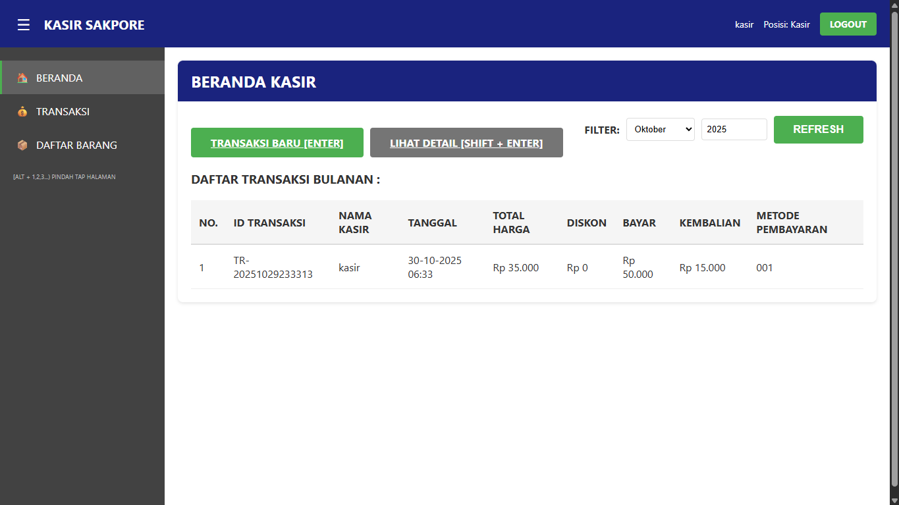
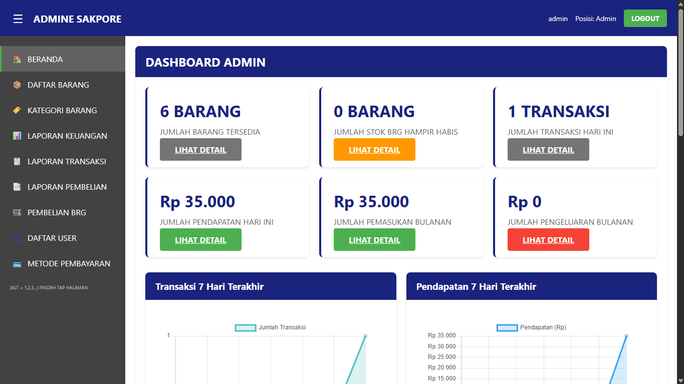

## Aplikasi Kasir SAKPORE (PHP Native)

Aplikasi kasir berbasis web menggunakan PHP Native dan MySQLi, dengan role Admin dan Kasir. Fokus pada struktur kode rapi, keamanan dasar (prepared statements), dan kemudahan deploy di Laragon/XAMPP. Sudah dilengkapi grafik statistik pada dashboard Admin (Chart.js).

### Fitur Utama
- **Autentikasi & Autorisasi**: Login, logout, session, role Admin/Kasir.
- **Master Data**:
  - Kategori Barang (CRUD, terpisah antara daftar dan tambah/edit)
  - Daftar Barang (CRUD, tambah/edit dipisah dari daftar, tambah stok)
  - User Management (CRUD, tambah/edit dipisah dari daftar)
  - Metode & Akun Pembayaran (CRUD, form terpisah)
- **Transaksi**:
  - Kasir: Simpan transaksi dengan detail, update stok dalam transaksi (atomic/transaction)
  - Pembelian Barang: Harga satuan otomatis dari harga pokok, total otomatis
- **Laporan**: Transaksi, Pembelian, Keuangan, Detail Transaksi
- **Dashboard Admin**: Grafik transaksi 7 hari, pendapatan 7 hari, pemasukan vs pengeluaran 6 bulan, top 5 kategori (Chart.js)
- **Path Helper**: Otomatisasi path relatif dengan `config/paths.php` agar aman saat project diletakkan dalam subfolder

### Teknologi
- PHP Native (MySQLi, prepared statements)
- MySQL
- HTML, CSS, JavaScript (vanilla)
- Chart.js untuk visualisasi

### Struktur Proyek
```
.
├── index.php
├── login.php
├── logout.php
├── .htaccess
├── database.sql
├── assets/
│   ├── css/
│   │   └── style.css
│   └── js/
│       └── main.js
├── config/
│   ├── database.php
│   ├── paths.php
│   └── session.php
├── includes/
│   ├── header.php
│   ├── footer.php
│   └── functions.php
├── admin/
│   ├── dashboard.php
│   ├── daftar_barang/
│   │   ├── index.php
│   │   ├── tambah.php
│   │   └── tambah_stok.php
│   ├── kategori_barang/
│   │   ├── index.php
│   │   └── tambah.php
│   ├── metode_pembayaran/
│   │   ├── index.php
│   │   ├── tambah_metode.php
│   │   └── tambah_akun.php
│   ├── pembelian_barang/
│   │   └── index.php
│   └── laporan/
│       ├── transaksi.php
│       ├── pembelian.php
│       ├── keuangan.php
│       └── detail_transaksi.php
└── kasir/
    ├── dashboard.php
    ├── transaksi.php
    └── daftar_barang.php
```

### Persiapan Database
1. Buat database MySQL baru atau gunakan yang sudah ada.
2. Import file `database.sql` ke database tersebut (berisi schema + sample data).
3. Sesuaikan kredensial koneksi di `config/database.php` bila diperlukan.

### Kredensial Login (Default)
- Username: `admin` / Password: `admin` (Admin)
- Username: `kasir` / Password: `kasir` (Kasir)

### Cara Menjalankan (Laragon/XAMPP)
1. Clone atau salin project ini ke folder web server (misalnya Laragon: `C:\laragon\www\Joki\random`).
2. Pastikan `Apache` dan `MySQL` berjalan.
3. Import `database.sql`.
4. Akses lewat browser ke alamat subfolder Anda, contoh: `http://localhost/Joki/random/`.

Catatan: Proyek ini memakai helper path relatif `config/paths.php` dengan fungsi `getNavPath()` dan `getAssetPath()` agar semua link dan asset tetap benar meskipun berada di subfolder.

### Konfigurasi Penting
- `config/database.php`: fungsi `getConnection()` dan helper `query`, `queryArray`, `queryOne`.
- `config/session.php`: helper login/logout, role guard (`requireAdmin`, `requireKasir`).
- `config/paths.php`: `getNavPath($targetPath)` dan `getAssetPath($file)` untuk path relatif.
- `includes/functions.php`: utilitas (format rupiah, sanitize, generator ID, stok, dll). Fungsi `updateStokBarang` didesain agar aman dipakai dalam transaksi aktif.

### Screenshot
Letakkan file gambar screenshot Anda di folder `assets/screenshot/` lalu sesuaikan path di bawah. Contoh penamaan:





Jika belum ada folder `assets/screenshot/`, silakan buat terlebih dahulu.

### Catatan Implementasi
- Form tambah/edit dipisah dari halaman daftar untuk modul: `daftar_barang`, `kategori_barang`, `user`, dan `metode_pembayaran` agar UI rapi.
- Transaksi kasir disimpan dalam satu transaksi database (atomic) untuk integritas data dan performa.
- Pembelian barang: harga satuan otomatis mengikuti harga pokok barang, total harga dihitung otomatis di frontend serta dikirim sebagai nilai murni ke backend.
- Dashboard Admin menggunakan Chart.js via CDN.

### Lisensi
Gunakan bebas untuk pembelajaran dan pengembangan internal. Sesuaikan sesuai kebutuhan.


